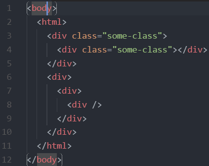

# higlight-matching-tag

This extension is intended to provide the missing functionality that should be built-in out of the box in VSCode - to highlight matching opening or closing tags.

## Features



## Extension Settings

Available settings (shown are default values):

```
"highlight-matching-tag.enabled": true
```
```
"highlight-matching-tag.highlightSelfClosing": false
```
```
"highlight-matching-tag.style": {
    "borderWidth": "0 1px",
    "borderStyle": "dotted",
    "borderColor": "white",
    "borderRadius": "5px"
}
```

## Known Issues

* Only works on opening tags yet
* Only works on non line-breaking tags yet

## Release Notes

### 0.1.0

Initial release of __highlight-matching-tag__